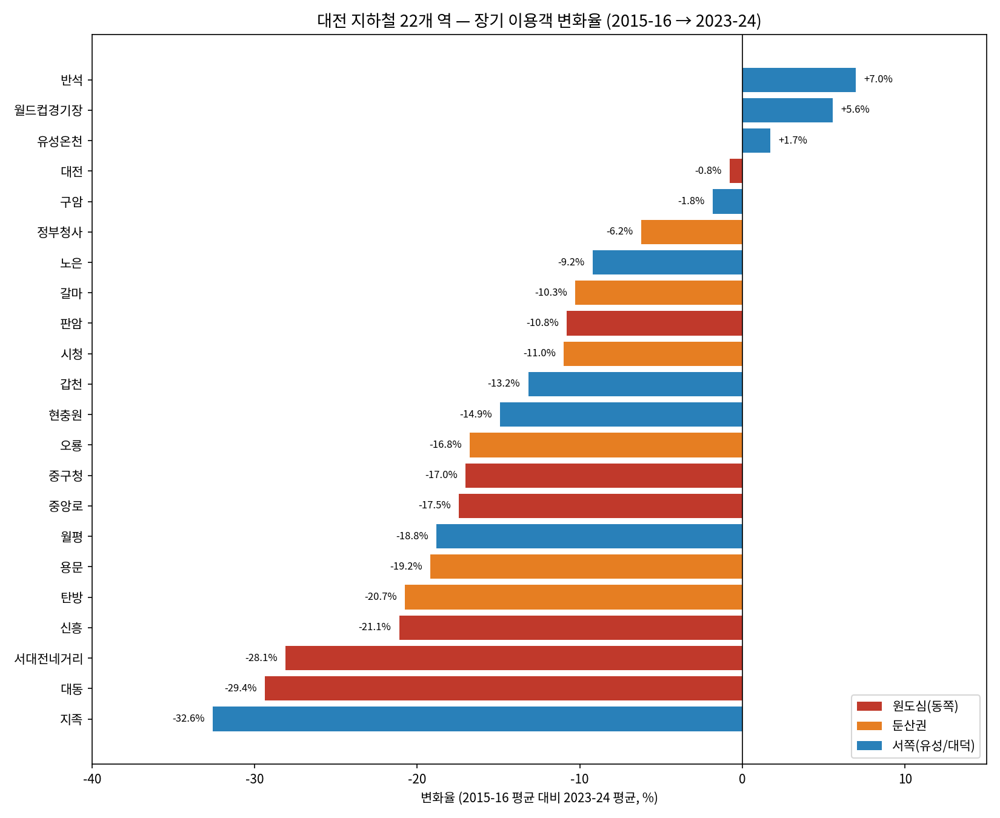
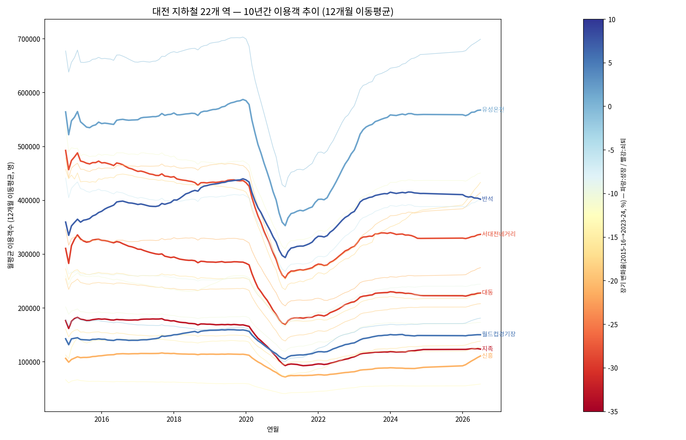
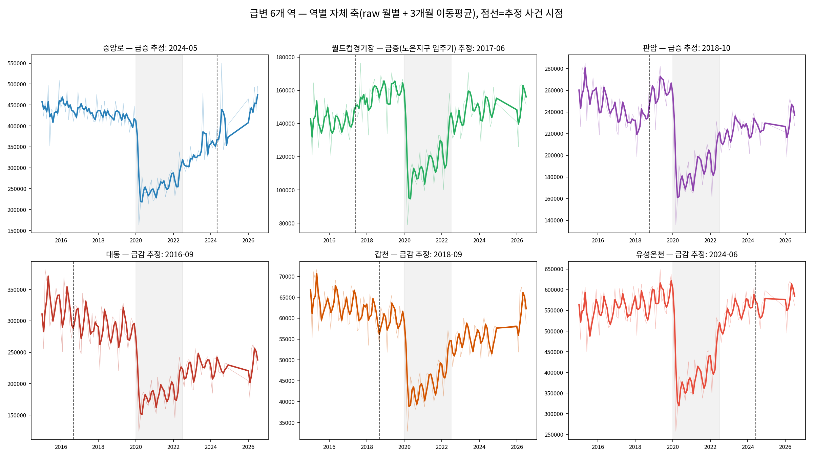

# 대전 지하철 22개 역 — 10년간 이용객 변화 트렌드 분석 리포트

*Codyssey AI Native Basic Course · 대전코디세이 캠퍼스 · "AI 데이터 분석: 데이터 기반 트렌드 분석" 미션*

---

## 1. 분석 주제 및 선정 이유

대전 도시철도 1호선 22개 역의 월별 승하차 인원(2015.01 ~ 2026.07)을 시계열로 분석했다.

처음 출발점은 "둔산 지역의 유동인구가 다른 지역으로 옮겨가는 것 같다"는 개인적 체감이었다. 이를 확인하기 위해 둔산 인접 4개 역(정부청사·시청·갈마·탄방)과 비교 지역 2개 역(유성온천·노은)을 나누어 비교하는 것으로 분석을 시작했다.

그러나 분석 도중, 이 구도 자체가 편협한 가설일 수 있다는 문제의식이 들었다. 22개 역 중 6개 역만 골라 비교하면, 애초에 가설에 부합하는 역만 들여다보는 확증편향에 빠질 위험이 있었다. 그래서 **분석 범위를 22개 역 전체로 확장**하고, "어느 역이 사양화되고 어느 역이 부흥하는가"를 편견 없이 탐색하는 방향으로 전환했다. 이 리포트는 그 전환 이후의 결과를 담는다.

## 2. 분석 질문

1. 대전 지하철 22개 역 전체는 지난 10년간 얼마나 변화했는가? 팬데믹 회복 이후에도 이 변화는 회복되지 않았는가?
2. 개별 역의 이용객 추세는 "시스템 전체와 함께 움직이는 공통 부분"과 "그 역만의 고유한 부분"으로 나눌 수 있는가? 있다면 후자가 유독 큰 역은 어디인가?
3. 역 고유의 변화는 실제로 "급변(계단식 변화)"인가, 아니면 "완만한 다년간 추세 전환"인가 — 이 둘을 가르는 요인은 무엇인가?
4. 인근 아파트 단지·상권의 변화가 실제로 이용객 그래프에 어떤 모양으로 나타나는가? 개발 방식(대단지 동시 입주 vs 여러 단계 개발)에 따라 그래프 모양이 달라지는가?

질문 1·2는 그래프로 바로 확인 가능한 것이고, 질문 3·4는 뉴스 등 외부 자료로 추가 해석이 필요한 것이다.

## 3. 데이터 설명

- **출처**: 대전교통공사 역별 수송실적 (연도별 CSV 11개)
- **기간**: 2015년 1월 ~ 2026년 7월 (단, **2025년 데이터는 원본 자료에 전체 누락**되어 있어 2024년 12월 다음이 2026년 1월로 바로 이어짐)
- **대상**: 대전 도시철도 1호선 전체 22개 역
- **데이터 포인트**: 22개 역 × 약 138개월 = 약 2,794건
- **원본 구조 문제**: 월별 승차/하차가 컬럼으로 나열된 가로형 구조 → 역명/년도/월/승차/하차의 세로형으로 변환 필요 (`merge_data.py`)
- **형식 오류**: 승차인원 컬럼이 콤마 포함 문자열로 되어 있어 숫자형으로 변환 필요

### 결측치·이상치 처리 (기준 및 근거)

- **결측치**: 2020년 6~12월(7개월) 데이터가 전체 역에 걸쳐 결측. 코로나19 확산 초기 자료 수집 차질로 추정. 7개월 연속 결측은 선형보간 시 왜곡 위험이 커서 **보간하지 않고 `is_data_gap` 플래그로 라벨링만 함**
- **이상치**: 12개월 이동평균 ±2표준편차 기준 129건 탐지, 대부분 2020~2022년(팬데믹 시기)에 집중 → 삭제하지 않고 `period_label = "팬데믹 구간"`으로 별도 라벨링
- **분석 중 추가로 발견한 데이터 이슈**: 2025년 전체 결측(위 참고). 이로 인해 "전후 N개월 비교"류의 계산에서는 반드시 날짜 기준으로 창(window)을 계산해야 하며, 행(row) 순서로 계산하면 2024년 12월과 2026년 1월을 인접한 것처럼 취급해 허위 급변 신호가 발생함을 확인 — 아래 6절에서 상술

## 4. 시계열 분석 기법

1. **이동평균**: 12개월(장기 추세), 3개월(단기 변동 완화, 계절성 일부 제거)
2. **전년동월대비(YoY) 증감률**: 계절성(설 연휴 등)의 영향을 통제하기 위해 사용
3. **시스템 공통추세 제거(잔차 분석)**: 22개 역 각각을 자기 2015년 평균 기준 지수화한 뒤, 날짜별 22개 역 평균 지수를 "시스템 공통추세"로 정의하고, 개별 역 지수에서 이를 빼서 "그 역만의 고유 변동(잔차)"을 분리

## 5. 시각화 결과 및 해석

### ① 22개 역 장기 변화율 순위 (2015-16년 평균 → 2023-24년 평균)

22개 역 평균 변화율은 **−13.0%, 중앙값 −13.7%**이며, 18개 역(약 82%)이 마이너스다. 플러스로 전환한 역은 반석(+7.0%)·월드컵경기장(+5.6%)·유성온천(+1.7%) 3곳뿐이다. 처음 가설의 비교 대상이었던 "둔산권"(정부청사 −6.2% ~ 탄방 −20.7%)과 "비교지역"(유성온천 +1.7% ~ 노은 −9.2%) 모두 내부 편차가 매우 커서, 애초의 두 그룹 비교 구도로는 이 편차를 설명할 수 없다.

### ② 22개 역 10년 추이 전체 (12개월 이동평균)

22개 선 전부가 2020~2021년에 거의 동시에 급락했다가 2022년부터 회복하는 공통된 U자형 궤적을 그린다. 역별 순위(위아래 위치)는 10년 내내 거의 유지되며, 순위가 크게 뒤바뀌는 구간은 드물다. 저점의 깊이와 회복 기울기의 역별 차이가, ①에서 계산한 최종 격차의 시각적 정체로 보인다.

### ③ 급변 후보 6개 역 상세 (역별 자체 축, raw 월별 + 3개월 이동평균)

시스템 공통추세를 제거한 잔차 기준으로 "역 고유의 변화"가 가장 컸던 6개 역(급증 3·급감 3)을 골라, 각 역을 자기 규모에 맞는 축으로 다시 그렸다. 여기서 이번 분석의 핵심 발견이 나왔다 — 아래 인사이트 ③ 참조.

## 6. 인사이트

### 인사이트 ① 대전 지하철은 10년째 구조적으로 축소 중이며, 팬데믹은 이 흐름의 원인이 아니라 급가속 요인이다

**관찰**: 22개 역 합산 총 이용객은 2015년 80,714,465명 → 2024년 71,237,929명으로 **−11.7%**. 팬데믹 직전인 2019년(80,383,908명) 대비로도 **−11.4%**로 거의 같은 낙폭이다.

**원인(가설)**: 대동역처럼 팬데믹 이전인 2014년에 이미 정점을 찍은 역이 있는 것으로 볼 때, 팬데믹 이전부터 완만한 감소가 시작되고 있었고 팬데믹이 그 위에 급격한 충격을 얹은 것으로 보인다. 자가용 보급 확대, 인구 자연감소, 재택·유연근무 확산 등 도시 차원의 구조적 요인이 저변에 있을 가능성이 있다.

**행동**: 이 분석 전체를 "특정 지역의 쇠퇴"가 아니라 "시스템 전체의 구조적 축소 위에서의 역별 편차"로 프레이밍한다.

### 인사이트 ② 역별 격차는 시스템 공통추세를 걷어내야 비로소 보인다

**관찰**: 22개 역 평균 지수를 공통 추세로 놓고 잔차를 계산한 결과, 중앙로(+10.3%p)·월드컵경기장(+9.5%p)·판암(+7.5%p)이 시스템 평균보다 유독 잘 나갔고, 대동(−5.3%p)·갑천(−4.9%p)·유성온천(−4.6%p)이 유독 못 나갔다.

**원인**: 팬데믹 회복기처럼 22개 역이 동시에 움직이는 시기에는 개별 역의 사건이 공통 흐름에 묻혀 보이지 않는다. 공통 추세를 제거한 잔차만이 "그 역에서만 일어난 일"을 가리킨다.

**행동**: 이 6개 역을 실제 지역 뉴스와 대조 검증했다 (인사이트 ③).

### 인사이트 ③ "급변"과 "완만한 추세"는 같은 원인(아파트/상권 변화)이라도 전혀 다른 그래프 모양을 만든다 — 이번 분석의 핵심 발견

**관찰**: 6개 역을 각자의 축으로 raw 월별 자료 + 3개월 이동평균으로 그려본 결과, 뚜렷하게 두 유형으로 갈렸다.

| 유형 | 역 | 그래프 모양 | 실제 근거(뉴스) |
|---|---|---|---|
| 계단식 급변 | **판암** | 2018년 9→10월 한 달 사이 235,926명→266,864명(+13%) 점프 후 새 수준 유지 | 삼정그린코아포레스트 1·2단지 총 1,565세대가 2018년 7월 동시 입주 |
| 계단식 급변(소폭) | **갑천** | 2018년 9월 근방 국지적 저점 이후 완만히 회복 | 도안 갑천지구 친수구역 개발계획 변경(2018.05)과 시기적으로 겹침 |
| 완만한 다년 추세(상승) | **월드컵경기장** | 특정 시점 없이 2015~2019년 4년에 걸쳐 계속 상승 | 노은지구 3·4지구 입주가 2014~2017년 여러 해에 걸쳐 단계적으로 진행 |
| 완만한 다년 추세(하락) | **대동** | 2016년 특정 시점이 아니라 2015년부터 이미 지그재그 하락 지속 | 2014년 피크 후 지속 감소 (나무위키 확인) — 재건축 전 노후주택 자연 이탈로 추정 |
| 추세의 정체(플래토) | **유성온천** | 뚝 떨어지지 않고 오르던 상승세가 2024년 근방에서 옆으로 누움 | 유성호텔(2024년 폐업) — 관광 유입 감소가 "감소"보다 "성장 정체"로 나타남 |
| 최근 반등 | **중앙로** | 2024년 초중반 작은 눌림 후 뚜렷한 상승 전환 | 대전역–은행동 지하상가 연결공사 완공(2023.7) + 중앙로 마중물 원도심 활성화 사업 |

**원인(가설)**: 같은 "아파트/상권 변화"라도, **대단지가 짧은 기간에 한 번에 입주하면 그래프에 계단식 점프로 찍히고, 개발이 여러 단계·여러 해에 걸쳐 진행되면 완만한 경사로 나타난다.** 처음 세웠던 "급작스런 변화 = 아파트/상권 원인"이라는 가설은 판암처럼 정확히 맞아떨어지는 경우도 있었지만, 월드컵경기장·대동처럼 실제로는 "급변"이 아니라 "장기 추세"였던 경우도 있었다.

**행동**: 원래 가설을 폐기하지 않고, "가설이 성립하는 조건(대단지·단기 집중 입주)"을 명확히 하는 방향으로 정교화한다.

### 인사이트 ④ 시각화 방법(스무딩 정도·축 스케일) 선택이 결론 자체를 바꿀 수 있다

**관찰**: 같은 판암역 데이터를 12개월 이동평균으로 그렸을 때는 "완만한 변화"로 보였지만, 3개월 이동평균/원자료로 그렸을 때는 "명확한 계단식 점프"로 드러났다. 마찬가지로 6개 역을 하나의 공유 축(절대량)에 함께 그렸을 때는 규모가 큰 역(유성온천 50만 명대)에 눌려 작은 역(갑천 6만 명대)의 변화가 거의 안 보였지만, 역별로 자기 축을 따로 주자 각자의 변화가 드러났다.

**원인**: 과도한 스무딩(12개월 이동평균)은 실제 존재하는 계단식 변화를 1년에 걸쳐 펴 발라 착시를 일으킨다. 규모가 다른 여러 역을 같은 축에 그리면 작은 역의 실제 변화가 큰 역의 변동폭에 가려 안 보인다.

**행동**: 역별 급변 여부를 판단할 때는 (1) 스무딩 창 길이, (2) 공유 축 vs 개별 축 여부에 따라 결론이 달라질 수 있음을 확인했고, 최종적으로 raw + 짧은 이동평균 + 역별 자기 축을 함께 사용해 검증했다.

**추가 검증 — 집계 단위(월 → 분기 → 연)를 바꾸면 같은 사건이 사라지는가**: 스무딩·축 선택뿐 아니라 "집계 단위" 자체를 바꿔도 결론이 달라지는지, 판암역의 2018년 10월 계단식 점프를 실제로 분기·연 단위로 재집계해 반례를 확인했다.

| 집계 단위 | 값 | 전기 대비 변화율 | 계단식 점프가 보이는가 |
|---|---|---|---|
| 월별(원자료) | 2018-09: 235,926명 → 2018-10: 266,864명 | **+13.1%** (한 달 사이) | ✅ 또렷함 — 정확히 몇 월에 일어났는지 특정 가능 |
| 분기별 재집계 | 2018 Q3: 703,441명 → 2018 Q4: 792,068명 | +12.6% (분기 사이) | ▲ 증가율 자체는 남아있지만, "10월에 집중된 사건"이라는 사실은 사라지고 Q4 전체(10~12월)에 걸쳐 서서히 늘어난 것처럼 보임 |
| 연별 재집계 | 2018년: 2,878,132명 → 2019년: 3,125,983명 | **+8.6%** (연간) | ❌ 거의 안 보임 — 그냥 완만한 연간 성장률로 보이고, 실제로는 특정 한 달에 몰린 계단식 사건이었다는 사실이 통계적으로 완전히 희석됨 |

**해석**: 월 단위를 분석의 기본 단위로 선택한 것은 임의 선택이 아니라, 이번 분석에서 발견한 사건들(아파트 동시 입주 등)이 대부분 "한 달 이내"에 집중적으로 발생하기 때문이다. 연 단위로 집계하면 사건 자체가 통계적으로 희석되어 "언제, 얼마나 급격했는가"라는 이번 분석의 핵심 질문에 답할 수 없게 된다.

다만 **더 세밀한 일/주 단위로는 검증하지 못했다** — 대전교통공사가 공개하는 원본 통계 자체가 월별 집계로만 제공되며, 일별·주별 원자료는 애초에 존재하지 않는다. 따라서 "월보다 잘게 쪼갰을 때도 같은 결론인가"는 이 데이터로는 확인 불가능하고, 위 표는 "월보다 굵게 묶으면 결론이 달라진다"는 반대 방향의 반례로 대신했다. 이 한계는 8절 한계점에도 명시한다.

### 인사이트 ⑤ 지리적 인접성보다 "무슨 일이 일어났는가"가 훨씬 강한 설명 변수다

**관찰**: 바로 옆 역인 반석(+7.0%, 전체 1위 성장)과 지족(−32.6%, 전체 1위 쇠퇴)이 정반대인 것처럼, 같은 유성구 권역 안에서도 월드컵경기장(상승)과 갑천(정체 후 소폭 하락)이 갈렸고, 같은 원도심 권역 안에서도 중앙로(최근 반등)와 대동(지속 하락)이 갈렸다.

**원인**: 권역이 아니라 "그 역 반경 안에 실제로 무슨 개발·폐업·인프라 사건이 있었는가"가 이용객 추세를 결정한다.

**행동**: 대전 지하철 이용객 변화는 지역 구도가 아니라 역 단위의 개별 사건으로 설명하는 것이 더 타당하다는 것을 이번 분석의 최종 결론으로 삼는다.

## 7. 결론 및 한계점

### 결론

- 대전 지하철은 지난 10년간 전체적으로 약 12% 축소되었으며, 이는 팬데믹 이전부터 시작된 구조적 흐름이다.
- 애초 세웠던 "둔산 vs 비교지역"이라는 지역 구도 가설은 데이터로 뒷받침되지 않았다. 두 그룹 모두 내부 편차가 너무 커서 그룹 단위 비교 자체가 무의미했다.
- 역별 격차는 지리적 인접성보다 "그 역 반경 안에서 실제로 일어난 사건"(대단지 입주, 호텔 폐업, 교통 인프라 개선 등)으로 훨씬 잘 설명된다.
- 이 사건들은 동일한 성격(아파트/상권 변화)이라도, 개발이 얼마나 짧은 기간에 집중되었는지에 따라 그래프상 "계단식 급변"과 "완만한 다년 추세"라는 서로 다른 두 가지 모양으로 나타난다.

### 한계점

- 지하철 데이터는 버스·자가용·도보 이용자를 포착하지 못해, 역 주변의 실제 유동인구 전체를 대변하지 못한다.
- 2025년 데이터가 원본 자료에 전체 누락되어 있어, 해당 구간의 변화는 추정할 수 없다.
- **원본 데이터 자체가 월별 집계로만 제공되어, 일/주 단위의 더 세밀한 분석은 시도할 수 없었다.** 대신 월→분기→연으로 재집계해 "집계 단위가 굵어지면 계단식 사건이 희석되어 보이지 않게 된다"는 반대 방향의 반례로 이를 대체 검증했다(인사이트 ④ 참조). 월보다 잘게 쪼갰을 때도 동일한 결론이 유지되는지는 이 데이터로는 확인 불가능하다.
- 뉴스로 확인한 원인들은 시기적 일치에 기반한 정황 증거이며, 인과관계를 통계적으로 증명한 것은 아니다.
- 급변 6개 역은 "시스템 공통추세 대비 잔차가 가장 큰 역"을 기준으로 선정했으며, 이는 하나의 통계적 정의일 뿐 유일한 정의는 아니다. 다른 기준(예: 절대적 변화 폭)으로는 다른 역이 선정될 수 있다.
- 갑천역은 6개 역 중 유일하게 뚜렷한 단일 원인을 특정하지 못했으며, 오히려 "애초에 역세권 자체가 약한 입지"라는 구조적 한계가 더 크게 작용하는 것으로 보인다.

## 8. AI 사용 로그

이 분석은 Claude와의 대화형 세션으로 진행했다. AI는 코드 작성·시각화·1차 조사를 빠르게 수행하는 도구로 활용했고, 방법론 선택과 최종 해석·결론은 매 단계 직접 근거를 확인하며 학습자 본인이 판단했다.

### 사용 작업

| 단계 | 작업 내용 | 비고 |
|---|---|---|
| 데이터 정제 | 원본 CSV 11개 병합, 가로형→세로형 구조 변환, 콤마 포함 문자열 → 숫자형 변환 | `merge_data.py`, `clean_data.py` |
| 결측치·이상치 처리 | 2020.06~12 결측 라벨링(`is_data_gap`), 이동평균 ±2표준편차 기준 이상치 탐지·라벨링(`period_label`) | 보간하지 않고 라벨링만 |
| 파생 지표 계산 | 12개월·3개월 이동평균, MoM/YoY 증감률, 시스템 공통추세 대비 잔차(역별 지수 − 22개 역 평균 지수) 계산 | pandas |
| 시각화 | 22개 역 순위 막대그래프, 10년 전체 추이 선그래프, 6개 역 역별-자체축 소그래프(small multiples) 등 총 6종 제작·반복 수정 | matplotlib, 한글 폰트(Noto Sans CJK KR) 설정 포함 |
| 원인 조사 | 판암·월드컵경기장·대동·갑천·유성온천·중앙로 6개 역 주변의 아파트 입주·재개발·시설 폐업 관련 뉴스·위키 검색 및 시기 대조 | 웹 검색 |
| 문서화 | 인사이트를 "관찰(Fact)–원인(Why)–행동(Action)" 구조로 정리, REPORT.md 초안 작성 | 본 문서 |
| 대시보드 기능 확장 | STL로 역별 계절 성분 계산 후 대시보드에 "계절성" 지표 옵션 추가(`page.tsx`, `lib/insights.ts`, `dashboard_data.json`), 재현용 스크립트(`py/generate_dashboard_seasonal.py`) 별도 작성 | statsmodels(STL) |

### 사용 이유

- **시간 절감**: 22개 역 × 10년치(약 2,800건) 데이터를 역별로 일일이 집계·시각화하는 반복 작업을 자동화
- **대안 탐색**: "급변 역"을 찾는 방법론이 한 번에 정해지지 않아, 여러 접근(행 순서 기반 vs 날짜 기반 창 계산, 원자료 vs 잔차 기준, 절대값 vs 시스템 공통추세 대비 등)을 빠르게 시도하고 비교하는 데 활용
- **배경지식 보완**: 대전 지역 개발 이슈에 대한 사전 지식이 부족해, 뉴스·위키 검색으로 원인 후보를 빠르게 찾는 데 활용

### 검증 방법

- **재현·수치 대조**: AI가 계산한 모든 집계 수치(연도별 총량, 역별 변화율, 상관계수 등)는 산출 직후 표로 직접 출력해 원자료와 대조했다. 예를 들어 "22개 역 평균 −13.0%"라는 수치는 22개 역 개별 값을 전부 나열해 직접 눈으로 재확인함
- **오류 발견 사례 1 (경계 오류)**: "행 순서 기반 전후 N개월 비교" 방식으로 급변 역을 탐지했을 때, 2026-01 근처에 급증이 몰리는 이상 패턴을 발견 → 원인을 추적한 결과 **2025년 데이터가 원본에 통째로 누락**되어 행 순서와 실제 날짜가 어긋난 것이 원인임을 확인하고, 날짜 기준 계산으로 수정
- **오류 발견 사례 2 (계절성 오염)**: 원자료 기준으로 다시 탐지했을 때 22개 역 전부가 2015년 3월(급증)·6월(급감)에 몰리는 패턴 발견 → 판암역 등 개별 역의 월별 원자료를 직접 출력해 대조한 결과, 설 연휴 등 계절 요인 및 데이터 초기 구간의 표본 부족(경계 효과)이 원인임을 확인하고 전년동월대비(YoY) 지표로 전환
- **오류 발견 사례 3 (과도한 스무딩)**: 12개월 이동평균 기준으로는 판암역의 변화가 "완만"해 보였으나, 사용자 지적에 따라 3개월 이동평균·원자료로 다시 확인한 결과 **2018년 9→10월 한 달 사이 235,926명→266,864명(+13%)의 실제 계단식 점프**가 있었음을 확인 — 시각화 방법 자체가 결론을 바꿀 수 있음을 직접 검증
- **빌드 검증**: 대시보드에 계절성 지표를 추가한 뒤 `npm run build`로 TypeScript 타입 에러 없이 컴파일되는지 직접 확인 후 배포함
- **집계 단위 반례 검증**: 평가 과정에서 "다른 집계 단위(일/주) 분석 미제공" 지적을 받아, 판암역을 월→분기→연 단위로 실제 재집계해 계단식 점프가 어느 단위부터 희석되어 사라지는지 직접 수치로 확인(인사이트 ④). 일/주 단위는 원본 데이터 자체가 제공하지 않아 시도 불가함을 확인하고 한계점에 솔직하게 남김
- **외부 근거 대조(가설 검증)**: AI가 제시한 원인 가설은 전부 실제 뉴스 기사·나무위키 등 원출처를 검색해 시기와 세부사항이 데이터와 일치하는지 대조했다 — 예: 판암역은 검색된 아파트 입주월(2018년 7월, 1,565세대)과 데이터상 점프 시점(2018년 10월)이 약 3개월 시차를 두고 실제로 일치함을 확인. 반대로 갑천역은 뚜렷이 일치하는 단일 사건을 찾지 못해, 리포트에도 "원인 미특정"으로 솔직하게 남김

## 9. 보너스 과제: 대시보드 서비스화

분석 결과를 정적 리포트에 그치지 않고, 기간·역·지표 조건을 직접 바꿔가며 탐색할 수 있는 웹 대시보드로 구현했다.

- **배포 URL**: https://data-based-trend.vercel.app
- **기술 스택**: Next.js (App Router) · TypeScript · Tailwind CSS · shadcn/ui · Recharts
- **데이터**: `data/cleaned_daejeon_metro.csv`에서 계산한 원자료·3개월/12개월 이동평균·YoY 증감률·시스템 공통추세 대비 잔차를 그대로 담은 정적 JSON(`public/data/dashboard_data.json`)을 사용 — 별도 백엔드나 DB 없이 정적 배포

### 기능

- **필터**: 역 다중 선택(기본값: 급변 6개 역 — 중앙로·월드컵경기장·판암·대동·갑천·유성온천), 기간 슬라이더(2015-01~2026-07), 지표 선택(원자료/3개월/12개월 이동평균/YoY/시스템 대비 잔차/**계절성**), 팬데믹 구간 표시 토글, 공유 축 vs 역별 자체 축 전환
- **계절성 지표**: STL(Seasonal-Trend decomposition, `py/generate_dashboard_seasonal.py`)로 역별 계절 성분을 추출해 제공. 원자료·이동평균이 "장기 방향"을 보여준다면, 계절성은 "그 역이 몇 월에 평년보다 높고 낮은지"라는 별도 질문에 답한다 — 지표 선택 시 해당 역이 가장 높은/낮은 달을 자동 문장으로 요약(`lib/insights.ts`)
- **22개 역 전체 순위 막대그래프**: 클릭하면 해당 역이 필터에 즉시 반영
- **동적 인사이트 패널**: 필터를 바꿀 때마다 현재 선택된 조건을 입력으로 다시 계산해 문장으로 요약 — 기간 내 전체 변화율, 구간 내 최대 변화 시점 자동 탐지(전후 6개월 슬라이딩 윈도우), 여러 역 비교, 시스템 평균 대비 잔차, 팬데믹 포함/제외 대조, 축 모드 전환 안내. 이 계산 로직은 본 분석에서 실제로 사용한 방법(날짜 기준 윈도우 계산, YoY로 계절성 통제 등)을 TypeScript로 그대로 이식한 것이다.

### 체험 시나리오 예시

1. 기본 화면에서 "역별 자체 축"으로 전환 → 판암역 그래프에서 2018년 10월 근방의 계단식 점프를 직접 확인
2. 팬데믹 구간 토글을 껐다 켜보며, 인사이트 패널에 뜨는 변화율 수치가 크게 달라지는 것을 확인 (인사이트 ①의 근거를 직접 재현)
3. 기간 슬라이더를 2015~2019로 좁혀 "공유 축"으로 보면, 22개 역 순위가 팬데믹 이후와 크게 다르지 않음을 확인
